# Infrastructure as Code
- [Infrastructure as Code](#infrastructure-as-code)
- [What is IaC?](#what-is-iac)
- [Benefits of IaC?](#benefits-of-iac)
- [When/where to use IaC](#whenwhere-to-use-iac)
- [What are the tools available for IaC?](#what-are-the-tools-available-for-iac)
  - [Configuration managment tools :](#configuration-managment-tools-)
  - [Orchestration( provision infrastructure)](#orchestration-provision-infrastructure)
- [What is configuration management (CM)?](#what-is-configuration-management-cm)
- [What is provisioning of infrastructure? Do CM tools do it?](#what-is-provisioning-of-infrastructure-do-cm-tools-do-it)
- [What is Ansible and how does it work?](#what-is-ansible-and-how-does-it-work)
- [Who is using IaC and Ansible in the industry](#who-is-using-iac-and-ansible-in-the-industry)
- [Ansible](#ansible)
- [What is Ansible?](#what-is-ansible)
- [How Does Ansible Work?](#how-does-ansible-work)
- [Key Features of Ansible](#key-features-of-ansible)
- [Key Features of Ansible Playbooks](#key-features-of-ansible-playbooks)
- [Ansible controller(control node)](#ansible-controllercontrol-node)
  - [How the Control Node Works with Target Nodes](#how-the-control-node-works-with-target-nodes)
- [Task: Create EC2 instances for Ansible controller and target node](#task-create-ec2-instances-for-ansible-controller-and-target-node)
  - [Step 1: Launch the 'Controller' EC2 Instance](#step-1-launch-the-controller-ec2-instance)
  - [Step 2: Launch the 'Target Node' EC2 Instance](#step-2-launch-the-target-node-ec2-instance)
  - [Step 3 : SSH into Both Instances](#step-3--ssh-into-both-instances)
  - [Step 4:](#step-4)
- [Task: Consolidate adhoc commands and document Ansible](#task-consolidate-adhoc-commands-and-document-ansible)
- [Ad Hoc commands](#ad-hoc-commands)
  - [General syntax](#general-syntax)
  - [Examples of Ad Hoc Commands](#examples-of-ad-hoc-commands)
- [Task: Work out the command to use to copy test.txt to your target node](#task-work-out-the-command-to-use-to-copy-testtxt-to-your-target-node)
  - [Method 1: Create the Playbook File](#method-1-create-the-playbook-file)
  - [Method 2](#method-2)


# What is IaC?

Infrastructure as Code (IaC) is a practice where infrastructure is provisioned and managed using code instead of manual processes. With IaC, you write scripts to automate the setup of servers, networks, databases, and other infrastructure components, making the process repeatable, scalable, and efficient. This code is typically stored in version control systems, allowing teams to track changes, collaborate, and revert to previous versions if necessary.


# Benefits of IaC?

* **Consistency**: Automates the deployment process, reducing the chances of human error.
* **Scalability**: Easily scale infrastructure up or down by changing the code and re-running it.
* **Version Control**: Infrastructure code can be tracked, managed, and reviewed, like application code.
* **Speed and Efficiency**: Quickly spin up environments, enabling faster development and testing.
* **Reusability**: Scripts can be reused across multiple environments (development, testing, production).
  
 


# When/where to use IaC

IaC is beneficial in scenarios where:

- Infrastructure needs to be set up consistently across multiple environments.
- Rapid scaling and provisioning of resources is required.
- Teams are using CI/CD pipelines for automated deployments.
- There is a need for disaster recovery or rolling back to previous stable configurations.
  
**Example Use Cases**:
- **Cloud Infrastructure**: Setting up virtual machines, storage, networking.
- **CI/CD Pipelines**: Automating the deployment process.
- **Multi-Region Deployments**: Consistent setup across different locations.
  
# What are the tools available for IaC?
## Configuration managment tools : 
- **Ansible**: Used for configuration management, application deployment, and task automation.
  
- **Puppet**: Automates the management of infrastructure and configuration.
  
- **Chef**: Provides a way to define infrastructure as code using recipes and cookbooks.
  
## Orchestration( provision infrastructure)

- **Terraform**: An open-source tool for building, changing, and versioning infrastructure efficiently.

- **CloudFormation**: AWS service that allows you to define and provision infrastructure using templates.

- **Ansible**: can be used as orchestration tool but not primarily design for this 

    


# What is configuration management (CM)?

**Configuration Management (CM)** is the process of maintaining systems in a consistent state by managing the configuration of infrastructure components. It involves automating the configuration of servers, applications, and other services, ensuring that environments are consistent across deployments.

**Difference from Provisioning:**
 - **Provisioning** refers to the setup of infrastructure resources (e.g., virtual machines, storage).
 - **CM** involves managing and maintaining the configuration of these resources once they are set up.
  


# What is provisioning of infrastructure? Do CM tools do it?

**Provisioning** involves the setup and allocation of infrastructure resources (e.g., virtual machines, databases, networks). It’s the process of making the necessary hardware or cloud resources available before they are configured for use.

While some CM tools (like Ansible) can handle simple provisioning tasks, dedicated tools like Terraform are better suited for managing the provisioning process, especially when dealing with complex infrastructure.

**Diagram Idea**: A flowchart comparing provisioning (initial setup) vs. configuration management (maintaining settings).

# What is Ansible and how does it work?

**Ansible** is an open-source automation tool used for configuration management, application deployment, and orchestration. It uses simple, human-readable YAML files called playbooks to define tasks and automate them across servers. Ansible uses an agentless architecture, meaning it does not require software to be installed on the servers it manages, relying on SSH for communication.

**How Ansible Works**:
- **Playbooks**: Define the tasks to be executed.
- **Inventory Files**: List the hosts and groups where tasks should be applied.
- **Modules**: Pre-built functions to perform tasks like installing software or managing users.

    


# Who is using IaC and Ansible in the industry

**Companies Using IaC**:
- **Netflix**: Uses IaC to manage its cloud infrastructure across regions.
- **Uber**: Automates deployments and scaling using Terraform and other IaC tools.
- **Amazon**: AWS provides tools like CloudFormation to encourage IaC practices.
- **Facebook**: Uses Ansible to manage server configurations.
  
**Benefits for Companies**:
- Faster and more consistent deployments.
- Easier scalability and management of cloud infrastructure.
- Reduced downtime due to automated failover and disaster recovery.


# Ansible 


# What is Ansible?
- **Ansible** is an **open-source automation tool** that helps with **configuration management**, **application deployment**, and **task automation** across multiple servers. It’s especially popular in DevOps for managing IT environments efficiently without requiring agents on remote systems.

- Ansible is designed to **simplify** the process of **managing** and **deploying software** and **configurations across multiple systems** by defining the **desired state** in **playbooks**.
-  Ansible works over **SSH**, so **no agents** are required on the systems it manages.
-   It also uses a **simple YAML-based language**, making it easy to learn and use


#  How Does Ansible Work?

 Ansible operates on a **controller machine** (where Ansible is installed), which manages **remote nodes** (the target nodes). Ansible uses:
  - **Inventory Files**: A list of systems you want to manage.
  - **Modules**: Small programs that Ansible runs on nodes, such as copy, service, ping, etc.
  - **Playbooks**: Files containing organized tasks and configurations written in YAML. Playbooks define what Ansible should do on each node.

**Example Workflow**:
  1. **Define Inventory**: Specify target nodes in an inventory file.
  2. **Write a Playbook**: Outline tasks in a playbook.
  3. **Run the Playbook**: Ansible connects to each node over SSH and performs the tasks.
   
Ansible communicates securely via SSH, which removes the need for installing any software on the target nodes. You can execute tasks as the logged-in user or with elevated privileges (using --become).


# Key Features of Ansible
- **Agentless**: No agents are required on managed nodes; it operates over SSH.
- **Declarative and Idempotent**: Ansible’s operations are idempotent, meaning they won’t repeat actions unnecessarily, which avoids making repeated changes.
- **Modular**: Ansible has a large library of modules (like copy, apt, yum, service, etc.) that perform different functions.
- **Simple Syntax**: Uses YAML-based playbooks, which are easy to read and write.
- **Extensible**: Ansible’s functionality can be extended with custom modules and plugins.

# Key Features of Ansible Playbooks

Playbooks are the core of Ansible’s configuration management and are written in YAML. They provide a way to automate complex tasks by defining a series of steps to be performed on target nodes.

**Key Features of Playbooks**:
- **Declarative**: Playbooks specify the desired state rather than individual commands.
- **Role-Based Structure**: Playbooks can be organized into roles, making configurations modular and reusable.
- **Task Organization**: Tasks are grouped under plays, which are executed in order on defined hosts.
- **Variables and Conditionals**: Playbooks support variables, conditionals, and loops, enabling dynamic configurations.
- **Error Handling**: Includes handlers that respond to specific task outcomes, like restarting services after configuration changes.


# Ansible controller(control node)

The Ansible Controller (also known as the Control Node) is the central machine from which Ansible is run. This is the system where you install Ansible and execute commands, playbooks, and modules to manage target nodes (or Managed Nodes). The controller manages all automation tasks, making it the main hub for Ansible operations.

**Key Responsibilities of the Ansible Controller**
1. **Running Playbooks and Commands**:

     - The control node is where you write and execute playbooks, ad hoc commands, and other automation tasks. The control node sends commands over SSH to target machines.

2. **Managing Inventory**:

      - The control node maintains an inventory file listing the hosts and groups of hosts that Ansible will manage. This inventory can be static or dynamic, with hosts grouped for easier management.

3. **Maintaining Configurations**:

      - The control node stores configuration files (e.g., ansible.cfg), which define how Ansible operates. This includes default settings for inventory paths, logging, connection types, and more.

4. **Processing Variables, Modules, and Plugins**:

    - Variables, modules, and plugins that are used across different Ansible operations are also maintained on the control node. This allows Ansible to extend its functionality, customize tasks, and integrate with external systems.
  
## How the Control Node Works with Target Nodes
The control node uses SSH to connect to each target node and perform the following actions:

- **Runs Modules**: Executes small programs (modules) on target nodes to perform specific tasks like installing software, copying files, or configuring services.
- **Transfers Files**: Moves files or resources needed for specific tasks, such as configuration files or templates.
- **Ensures Idempotence**: By checking the state of target nodes, the controller ensures tasks only run when necessary.

Since Ansible is agentless, the controller doesn’t need any software installed on the target nodes, just SSH access.

# Task: Create EC2 instances for Ansible controller and target node

* Create 2 instances on AWS:
  * Ansible 'controller' instance:
    * Name: tech2xx-ramon-ubuntu-2204-ansible-controller
    * Security group: Allow SSH port
    * Key pair: Use the one you usually use for your AWS instances
    * Image - Ubuntu Server 22.04 LTS (free tier eligible)
    * Leave it blank - don't run any scripts or user data on it
  * Ansible 'target node' instance (will run the app)
    * Name: tech2xx-ramon-ubuntu-2204-ansbile-target-node-app
    * Security group: Allow SSH, HTTP, port 3000 (the usual for the app)
    * Key pair: Use the one you usually use for your AWS instances (and the same one as you used on the controller)
    * Image - Ubuntu Server 22.04 LTS (free tier eligible)
    * Leave it blank - don't run any scripts or user data on it
* Check you can SSH into both machines (preferably do it separate Git Bash)


## Step 1: Launch the 'Controller' EC2 Instance

1.	**Go to the EC2 Dashboard in AWS**.
2.	**Click "Launch Instance"**.
3.	**Instance Details**:
    1.  **Name**: `tech2xx-maria-ubuntu-2204-ansible-controller`
    2. **AMI** : Select **Ubuntu Server 22.04 LTS (HVM), SSD Volume Type (Free Tier Eligible)**
    3.	**Instance Type**: Select **t2.micro** (for free-tier eligibility)
4.	**Security Group**:
    * Create a security group or select an existing one that allows **SSH (Port 22)** access.
5.	**Key Pair**:
    *	Choose the key pair you regularly use for your AWS instances.
6.	**Advanced Settings**:
    *	Leave **the User Data** section blank.
7.	**Launch the Instance**.

## Step 2: Launch the 'Target Node' EC2 Instance
1.	**Go to the EC2 Dashboard**.
2.	**Click "Launch Instance"**.
3.	**Instance Details:**
    1.**Name**: `tech2xx-maria-ubuntu-2204-ansible-target-node-app`
    2.	**AMI**: Select **Ubuntu Server 22.04 LTS (HVM), SSD Volume Type (Free Tier Eligible)**
    3.	**Instance Type**: Select **t2.micro** (for free-tier eligibility)
4.	**Security Group**:
    *	Create a security group or select an existing one that allows **SSH (Port 22), HTTP (Port 80)**, and **Port 3000**.
5.	**Key Pair**:
    *	Choose the same key pair you used for the controller instance.
6.	**Advanced Settings**:
    *	Leave the **User Data** section blank.
7.	**Launch the Instance**.


## Step 3 : SSH into Both Instances

```bash
ssh -i "~/.ssh/private-key....
```

## Step 4:

1. 💠 **update** the fresh vm (both the controller and target nodes) 
```bash
sudo apt update -y
```
2. 💠 **upgrade** 
```bash
sudo DEBIAN_FRONTEND=noninteractive apt upgrade -y
```
3. 💠 **install ansible repository** 

```bash
sudo apt-add-repository ppa:ansible/ansible
```
4. 💠 **upgrade** 
```bash
sudo DEBIAN_FRONTEND=noninteractive apt upgrade -y
```
5. 💠 **install ansible** 
```bash
sudo apt install ansible -y
```
6. 💠 **check ansible version** 
```bash
ansible --version
```

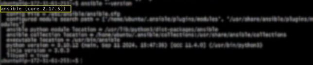

7. 💠 **check the ansible folder** 
```bash
cd /etc/ansible
```
8. 💠
```bash
ls
```

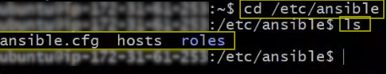

9. 💠
```bash
ls -a
```
10. 💠
```bash
ls -l 
```

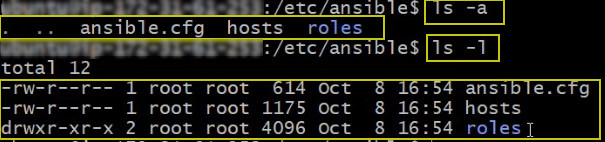

11. 💠 **back to home directory** 
```bash
cd
```
12. 💠 **see the hidden folders in home directory** 
```bash
ls -a 
```
13. 💠  **store the private key into .ssh folder** 
```bash
cd .ssh
```

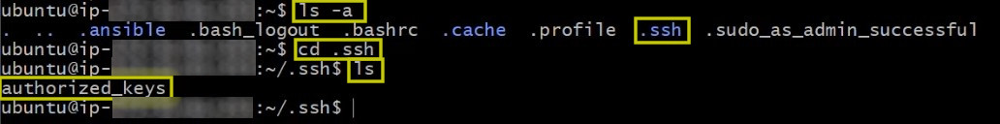

```bash
# opne a new gitbash  -> cd .ssh
# find the private aws key (private-key.pem)
```
```bash
cat aws-private-key.pem
#copy the key
# in gitbash controller 
nano aws-private-key.pem
#paste the key
# CTRL + S
# CTRL + X
ls
```

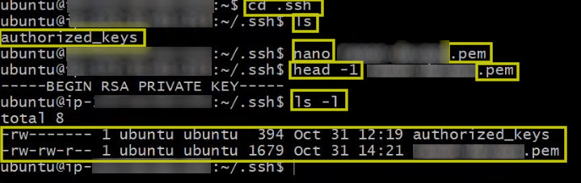

14. 💠 **remove permision** 
```bash
chmod 400 "aws-private-key.pem"
```

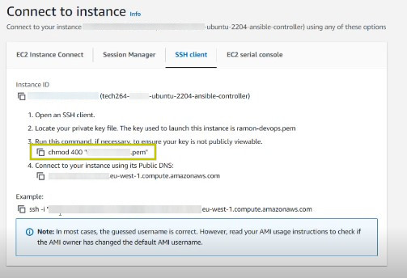

15. 💠 **check permision again after apply chmod 400** 
```bash
ls -l 
```

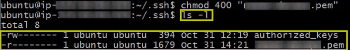

16.  💠 **ask ansible to communicate with all devices** 
```bash
ansible all -m ping
```

 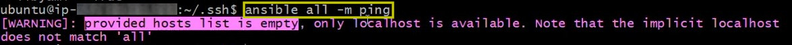


17. 💠 **edit the ansible inventory** 
```bash
cd /etc/ansible
```
18. 💠 **nano hosts** 
```bash
sudo nano hosts
```

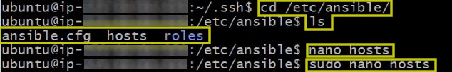

```bash
localhost ansible_connection=local
#if you want the controller to be able to configureyour local machine itself with ansible
```

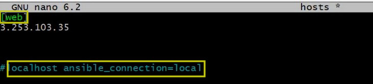

```bash
3.253.103.35 # change with the public ip address of target nodes instance
```
19. 💠  **run again ansible all -m ping after setting up the hosts** 
```bash
ansible all -m ping
```

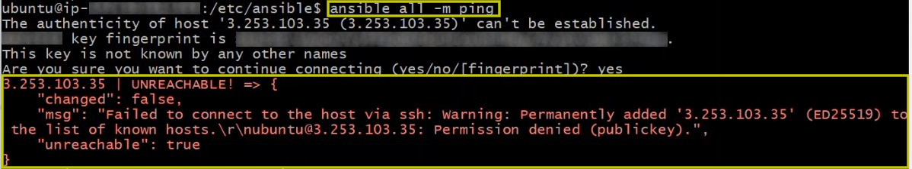

❗❗❗ **Permission denied** -> we need to **tell** what **key** to use.

```bash
nano hosts
```
🟢 **[web]**
- 🟢 **label** : `ec2-app-instance` 🟢ansible_host=3.253.103.35 🟢 ansible_user=ubuntu 🟢 ansible_ssh_private_key_file=~/.ssh/private-aws-key.pem

```bash
[web]
ec2-app-instance ansible_host=3.253.103.35  ansible_user=ubuntu  ansible_ssh_private_key_file=~/.ssh/private-aws-key.pem
```

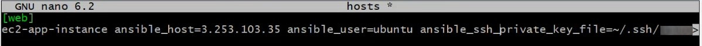

20. 💠 **run again ansible all -m ping** 

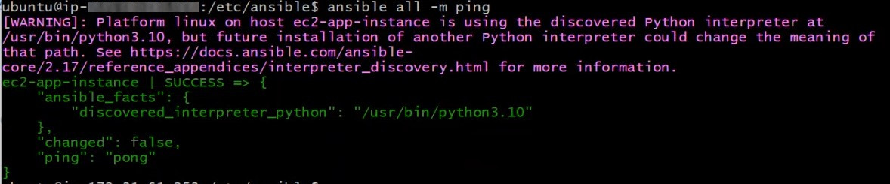

21. 💠 **to only ping a particular group**  
```bash
ansible web -m ping
```
22. 💠 ❗❗❗ **subgroups** 
```bash
sudo nano hosts
```

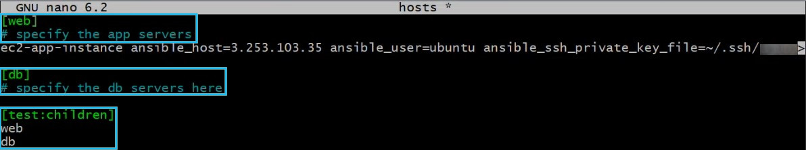

❗❗❗ To ping both **web** and **bd** 
```bash
ansible test -m ping
# the parent
```
23.💠 **display inventory** 
```bash
ansible-inventory --list
```
```bash
ansible-inventory --graph
```
24.💠 ❗❗❗ **adhoc command** 
```bash
ansible web -a "uname -a"
# return output from our target node machine
```
```bash
ansible web -a "date"
# return output from our target node machine
```
25. 💠 **make a test file in home directory** 
```bash
echo "hello, Im a test file" > test.txt
```
26. 💠 ❗❗❗ **playbook** 
```bash
cd /etc/ansible
```
```bash
sudo nano install_nginx.yaml
```

```bash
# starts with --- (three hyphens)
---

# name of the play
- name: install nginx play
  # where (on which devices - run this playbook)
  hosts: web

  # get comprehensive facts on the hosts
  gather_facts: yes

  # do we need to provide admin access - use sudo
  become: true

  # instruction which are known as "tasks"
  # task - install nginx
  tasks:
  - name: install and configure nginx
    # use package "nginx", "state=present" means we need it running
    apt: pkg=nginx state=present

# ends with ... ( three dots)
```
❗❗❗ to make the **playbook run faster** -> ❗ **gather_facts: no** ❗ 

Gather_info : 
- it gates info on the operating system of the host
- distribution used
- IP address
- network configuration
- storage configuration
  

27. 💠 ❗❗❗ **run playbook**
```bash
ansible-playbook install_nginx.yaml
```

28. 💠 **check the playbook in target nodes bash to see the status of nginx** 
```bash
sudo systemctl status nginx
```


# Task: Consolidate adhoc commands and document Ansible

1.	Use adhoc command to copy the private key (see note below) on AWS from controller to target node node
```bash
ansible ec2-app-instance -m ansible.builtin.copy -a "src=~/.ssh/private-aws-key.pem dest=/home/ubuntu/.ssh/private-aws-key.pem mode=0600" --become

```
Link to help with adhoc commands: https://docs.ansible.com/ansible/latest/user_guide/intro_adhoc.html
Note about the private key: This will mostly likely be...
  - tech264.pem (if using a private key shared with the whole group) or
  - whatever private key you are using personally for your AWS instances

# Ad Hoc commands 

**Ad hoc commands** are quick, one-liner commands that let you perform tasks on remote servers managed by Ansible without the need to write a playbook. 

They are useful for:
-	Running a quick task across one or multiple hosts.
-	Testing and troubleshooting connections.
-	Executing commands or modules to perform actions like installing software, copying files, or restarting services.

## General syntax
```bash
ansible <host-pattern> -m <module> -a "<arguments>" [options]
```
## Examples of Ad Hoc Commands
1.	**Ping a Host: Check if a host is reachable.**
```bash
ansible all -m ping
```
2.	**Copy a File to a Remote Host**:
```bash
ansible target_node -m ansible.builtin.copy -a "src=/path/to/local/file dest=/path/on/remote/machine" --become
```
3.	**Install a Package (e.g., nginx on a Debian-based system)**:
```bash
ansible target_node -m ansible.builtin.apt -a "name=nginx state=present" --become
```
4.	**Restart a Service (e.g., nginx)**:
```bash
ansible target_node -m ansible.builtin.service -a "name=nginx state=restarted" --become
```
Using **Ad Hoc Command** to **Copy a Private Key** to a **Target Node**

```bash
ansible target_node -m ansible.builtin.copy -a "src=/path/to/tech264.pem dest=/home/ubuntu/.ssh/tech264.pem mode=0600" --become
# /path/to/tech264.pem with the location of the key on your controller.
# the mode=0600 ensures the key file has secure permissions.
# 	--become is used if you need elevated privileges to copy to the .ssh directory.
```


❗❗❗ `--become` - used to escalate privileges, allow the command to be executed with superuser(root) privileges on the remote host

1.  **File Permissions on the Destination Path**:
-	If you’re copying the file to a protected directory, like `/home/ubuntu/.ssh/`, you’ll need `--become` because `.ssh` is typically restricted to the user or requires root privileges.
-	Without `--become`, Ansible would attempt to copy the file as the regular user (e.g., ubuntu), which may result in a "permission denied" error.
2.  **Task Requirements**:
-	Certain tasks, like installing software or modifying system files, typically require elevated privileges. For these tasks, using **--become** ensures they are executed as root or with the necessary permissions.


# Task: Work out the command to use to copy test.txt to your target node

To copy `test.txt` to your target node using the Ansible `copy module`

## Method 1: Create the Playbook File
```bash
cd /etc/ansible
```
```bash
sudo nano copy_test_file.yml
```
```bash
---
- name: Copy test.txt to target node
  hosts: web
  become: true         #  if root privileges are needed
  tasks:
    - name: Copy test.txt file
      ansible.builtin.copy:
        src: ~/test.txt  
        dest: ~/test.txt  
```

## Method 2 
```bash
ansible web -m ansible.builtin.copy -a "src=~/test.txt dest=~/test.txt"
```
