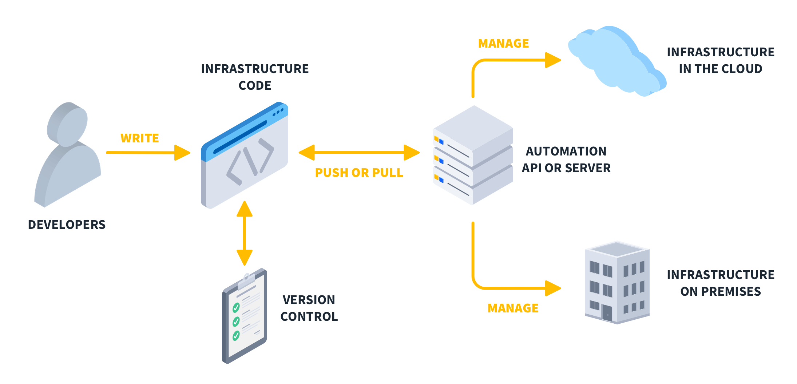
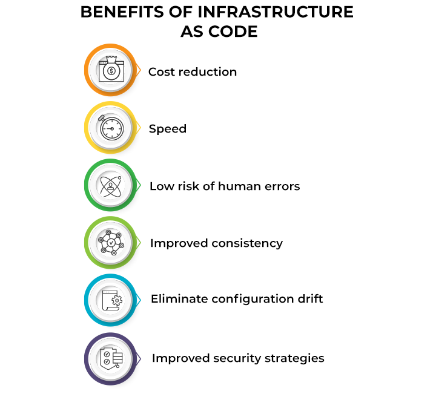
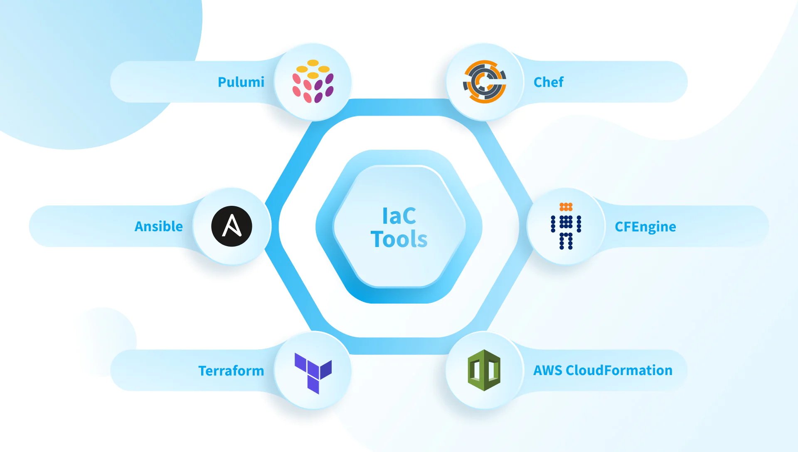
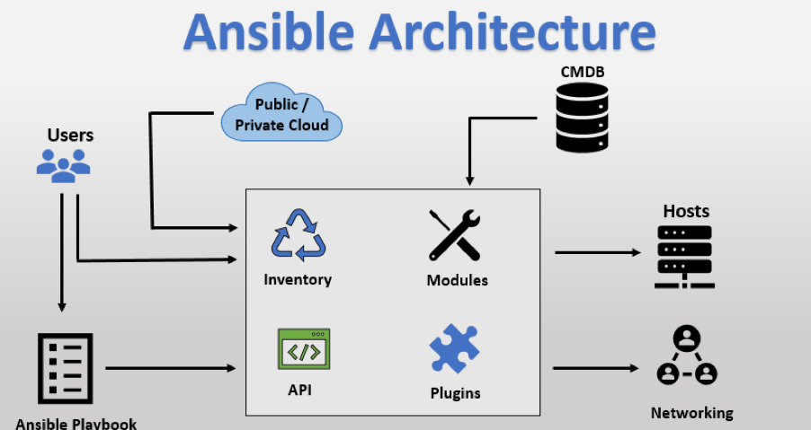

# Infrastructure as Code

# What is IaC?

Infrastructure as Code (IaC) is a practice where infrastructure is provisioned and managed using code instead of manual processes. With IaC, you write scripts to automate the setup of servers, networks, databases, and other infrastructure components, making the process repeatable, scalable, and efficient. This code is typically stored in version control systems, allowing teams to track changes, collaborate, and revert to previous versions if necessary.

# Benefits of IaC?

* **Consistency**: Automates the deployment process, reducing the chances of human error.
* **Scalability**: Easily scale infrastructure up or down by changing the code and re-running it.
* **Version Control**: Infrastructure code can be tracked, managed, and reviewed, like application code.
* **Speed and Efficiency**: Quickly spin up environments, enabling faster development and testing.
* **Reusability**: Scripts can be reused across multiple environments (development, testing, production).
  
 

# When/where to use IaC

IaC is beneficial in scenarios where:

- Infrastructure needs to be set up consistently across multiple environments.
- Rapid scaling and provisioning of resources is required.
- Teams are using CI/CD pipelines for automated deployments.
- There is a need for disaster recovery or rolling back to previous stable configurations.
  
**Example Use Cases**:
- **Cloud Infrastructure**: Setting up virtual machines, storage, networking.
- **CI/CD Pipelines**: Automating the deployment process.
- **Multi-Region Deployments**: Consistent setup across different locations.
  
# What are the tools available for IaC?

- **Terraform**: An open-source tool for building, changing, and versioning infrastructure efficiently.
- **Ansible**: Used for configuration management, application deployment, and task automation.
- **CloudFormation**: AWS service that allows you to define and provision infrastructure using templates.
- **Puppet**: Automates the management of infrastructure and configuration.
- **Chef**: Provides a way to define infrastructure as code using recipes and cookbooks.

    

# What is configuration management (CM)?

**Configuration Management (CM)** is the process of maintaining systems in a consistent state by managing the configuration of infrastructure components. It involves automating the configuration of servers, applications, and other services, ensuring that environments are consistent across deployments.

**Difference from Provisioning:**
 - **Provisioning** refers to the setup of infrastructure resources (e.g., virtual machines, storage).
 - **CM** involves managing and maintaining the configuration of these resources once they are set up.
  

# What is provisioning of infrastructure? Do CM tools do it?

**Provisioning** involves the setup and allocation of infrastructure resources (e.g., virtual machines, databases, networks). It’s the process of making the necessary hardware or cloud resources available before they are configured for use.

While some CM tools (like Ansible) can handle simple provisioning tasks, dedicated tools like Terraform are better suited for managing the provisioning process, especially when dealing with complex infrastructure.

**Diagram Idea**: A flowchart comparing provisioning (initial setup) vs. configuration management (maintaining settings).

# What is Ansible and how does it work?

**Ansible** is an open-source automation tool used for configuration management, application deployment, and orchestration. It uses simple, human-readable YAML files called playbooks to define tasks and automate them across servers. Ansible uses an agentless architecture, meaning it does not require software to be installed on the servers it manages, relying on SSH for communication.

**How Ansible Works**:
- **Playbooks**: Define the tasks to be executed.
- **Inventory Files**: List the hosts and groups where tasks should be applied.
- **Modules**: Pre-built functions to perform tasks like installing software or managing users.

# Who is using IaC and Ansible in the industry

**Companies Using IaC**:
- **Netflix**: Uses IaC to manage its cloud infrastructure across regions.
- **Uber**: Automates deployments and scaling using Terraform and other IaC tools.
- **Amazon**: AWS provides tools like CloudFormation to encourage IaC practices.
- **Facebook**: Uses Ansible to manage server configurations.
  
**Benefits for Companies**:
- Faster and more consistent deployments.
- Easier scalability and management of cloud infrastructure.
- Reduced downtime due to automated failover and disaster recovery.